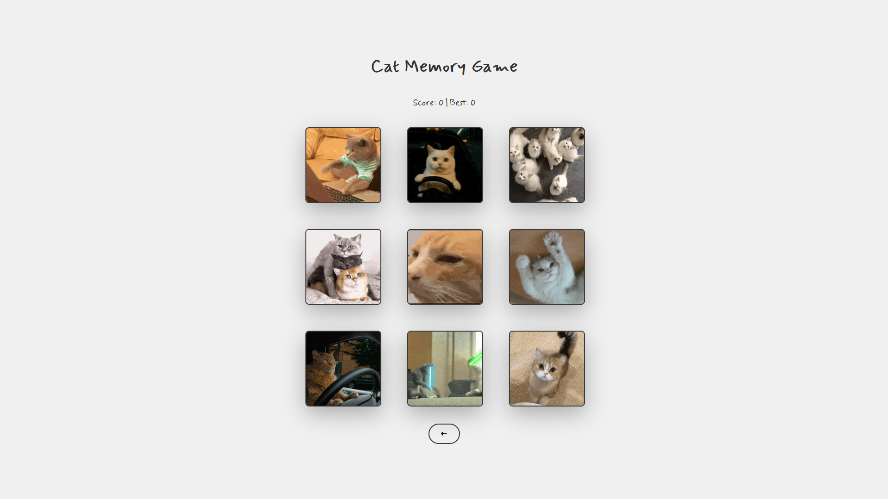

<h1 align="center">
  Cat Memory Game 
  <h4 align="center">A Cat memory card game built with React</h4>
</h1>

## 🚀 Live Site

The live site can be viewed [here](https://memorygame-orokidd.vercel.app/).

## 📝 Project Description

The [project specification](https://www.theodinproject.com/lessons/node-path-react-new-memory-card) describes the general instructions in doing the project. This project primarily served as practice for understanding state and effects in React.
